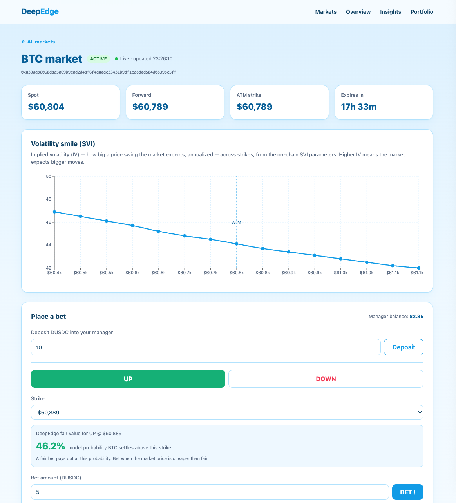
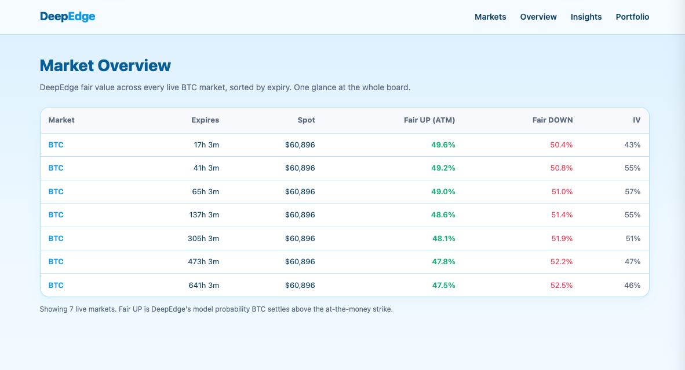
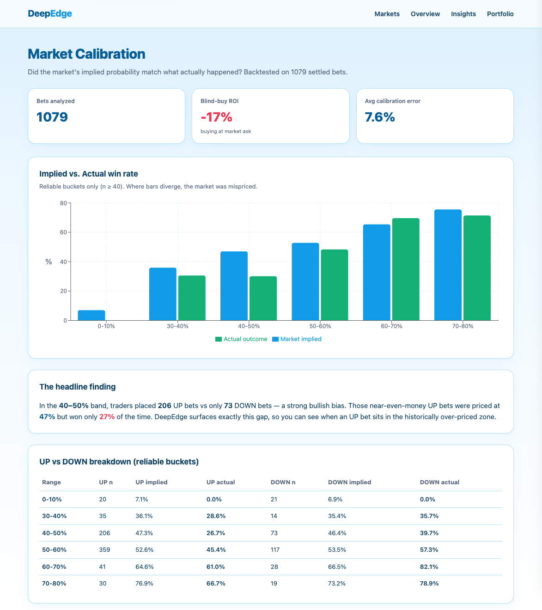
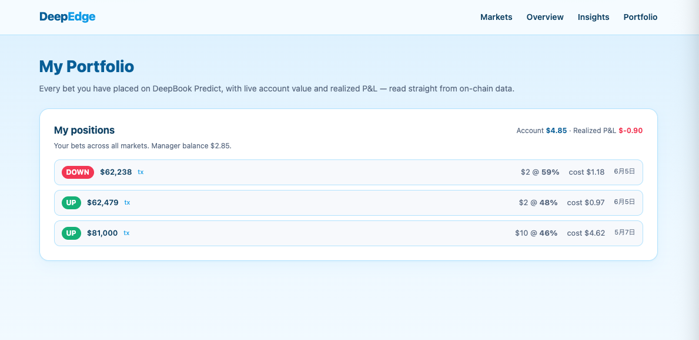

# DeepEdge

**Don't Bet Blind. See the Math.**

A trader-facing analytics and betting layer for DeepBook Predict on Sui — see the fair-value math behind every market, then place a bet in one tap.

> Submission for Sui Overflow 2026 — DeepBook Track



---

## The problem

Prediction markets today let you bet, but not *think*. As the official DeepBook Predict brief puts it, most venues "have no real notion of an underlying volatility surface." Traders see an odds number and click — with no way to ask *is this price fair?*

DeepBook Predict fixes the protocol side: it prices every strike and expiry against a live SVI volatility surface. But the trader still needs a lens to read that surface and judge each bet. **That lens is DeepEdge.**

---

## What DeepEdge does

DeepEdge sits on top of DeepBook Predict and turns its on-chain volatility surface into something a trader can actually use:

- **Fair value for every strike.** We read each oracle's on-chain SVI parameters and compute the model probability that BTC settles above (UP) or below (DOWN) each strike, using an SVI total-variance model with log-normal binary pricing.
- **The volatility smile, visualized.** Every market's implied-volatility curve across strikes, rendered live, so you can see the skew the market is pricing in.
- **Market calibration, measured.** A backtest over 831 settled bets shows exactly where the market is reliable and where it is systematically mispriced (details below).
- **One-tap betting.** Connect a wallet, see the fair value, confirm, and place a real on-chain bet — deposit DUSDC into your PredictManager and mint a position, all from the market page.
- **Your positions, tracked.** Every bet you place, with fill price, cost, and realized P&L, read straight from on-chain data.

---

## It actually works

This is not a mockup. The full loop runs end-to-end on Sui testnet:

```
connect wallet (Slush)
  -> see DeepEdge fair value
  -> choose UP / DOWN + strike
  -> confirm
  -> sign in wallet
  -> on-chain deposit + mint
  -> position appears in Portfolio
```

Real testnet transactions have been placed through this UI: DUSDC deposited into a PredictManager, UP and DOWN positions minted via a 2-step PTB (market_key::up|down, then predict::mint), and the resulting positions and realized P&L read back from the indexer. The minimum requirement "we will test the entire flow" is satisfied today.

---

## Honest analysis (the part most tools skip)

DeepEdge's calibration backtest is built to be *trustworthy*, not flattering.

**The headline finding** — over 831 settled bets (77 traders, extreme asks removed, no look-ahead: market ask at mint-time vs realized outcome):

| Implied range | n   | implied | actual | reading |
|---------------|-----|---------|--------|---------|
| 40-50%        | 210 | 46.6%   | 35.7%  | market over-prices by ~11% |
| 50-60%        | 363 | 53.2%   | 54.8%  | well-calibrated (+1.7%) |

Splitting by direction sharpens it: **near-even-money UP bets (40-50%, n=144) imply 46.7% but win only 34.0%** — a -12.7% gap. DeepBook Predict's testnet crowd is structurally bullish (about 70% of bets are UP), and it over-buys cheap UP positions. The 50-60% band is well-calibrated for both directions. Blind betting at the market ask returns about **-9%** (the spread).

**What we explicitly do not claim.** We also computed a Brier-score accuracy comparison that looked spectacular (83% "improvement"). We caught it as a **look-ahead artifact** — our fair value uses SVI observed about 5 seconds before settlement, by which point the forward is already ~99.9% of the settlement price. So that number measures SVI internal consistency, not predictive skill. We keep the endpoint but flag it openly and never present it as evidence of beating the market. Tail buckets (n<40) are labeled suggestive, not conclusive.

DeepEdge's real value is to **surface** where the market is reliable and where it is systematically off — not to promise profit on a thin testnet dataset.

---

## Five screens

- **Markets** — every live BTC oracle, sorted by expiry, with "closing soon" flags.
- **Overview** — DeepEdge fair value across all live markets in one table; the whole board at a glance.
- **Market detail** — the SVI volatility smile, a full fair-probability table by strike, live auto-refresh every 30s, and the bet panel.
- **Insights** — the calibration backtest, visualized: where the market is mispriced, by direction.
- **Portfolio** — your on-chain betting history, account value, and realized P&L.

**Overview** — fair value across every live market:



**Insights** — the calibration backtest, visualized:



**Portfolio** — real on-chain positions and P&L:



---

## Tech stack

- **Fair-value engine:** Rust (Axum + Tokio). SVI total-variance model, log-normal binary pricing, calibration and accuracy backtests. About 20 logic tests.
- **Frontend:** Next.js 14 (App Router), TailwindCSS, @mysten/dapp-kit for wallet connection and transaction signing, Recharts for the smile.
- **On-chain:** DeepBook Predict on Sui testnet — predict::mint, predict_manager::deposit, market_key::up|down, DUSDC quote asset.
- **Data:** the public Predict indexer (predict-server.testnet.mystenlabs.com) plus direct Sui RPC.
- **Infrastructure:** a self-hosted Sui mainnet full node (8ms vs ~123ms public-RPC latency), run since before the hackathon.

---

## API

Rust backend (port 3000):

- `GET /api/markets` — all DeepBook Predict BTC oracles
- `GET /api/markets/:oracle_id/strikes` — per-strike fair UP/DOWN from the SVI smile
- `GET /api/markets/:oracle_id/edges` — fair vs market ask, where order-flow exists
- `GET /api/backtest/calibration` — the calibration report above
- `GET /api/manager?owner=` — discover a wallet's PredictManager
- `GET /api/manager/positions?manager=` — a manager's bet history
- `GET /api/manager/summary?manager=` — account value, realized P&L, balance

---

## Roadmap to mainnet

DeepBook Predict launches on mainnet in Q3, and hackathon projects are expected to redeploy on day one. DeepEdge is built for that day:

- **Day-one redeploy** via the self-hosted mainnet node — the latency edge matters most when real order-flow arrives.
- **Edge ranking.** On testnet, live order-flow is too thin to rank markets by fair-vs-market edge (we verified: market quotes are near-zero across active markets, so this would be vapor). On mainnet, with real participants, DeepEdge will rank the most mispriced bets in real time — the natural extension of the calibration work.
- **Deeper position analytics** as settled history accumulates.

---

## Author

**Iwao Kai** — Rust/Move engineer, self-hosted Sui node operator. GitHub: IWAOKAI

## License

MIT
